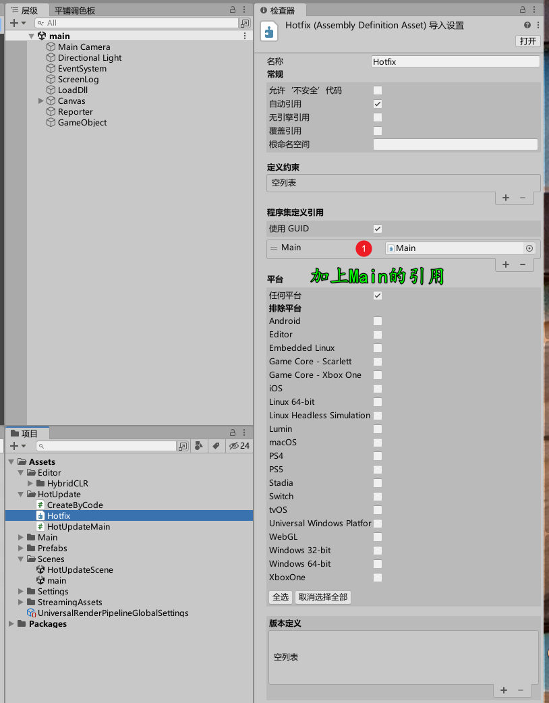

# 项目初始化过程

## Unity项目初始化

1. Unity项目建立完成以后,移除不需要的包,因为不使用vscode和visual studio,所以移除了这两个包

## 修改编译选项

1. 修改编译选项,见下图:

## 从示例项目里面拷贝基本内容

1. 示例项目:https://gitee.com/focus-creative-games/hybridclr_trial.git

2. 从示例项目拷贝如下的内容到当前项目

## 添加hybridclr_unity

1. 项目地址:https://gitee.com/focus-creative-games/hybridclr_unity.git

2. 打开Unity的包管理器,执行如下图的操作

3. 把地址"https://gitee.com/focus-creative-games/hybridclr_unity.git"填进去,等待安装完成

## 安装hybridclr

1. 如下图的操作步骤:

## 制作热更程序集

1. 按照如下的步骤,制作热更程序集

2. 修改Assets/Main/LoadDll.cs里面的内容,如下

3. 热更程序集加上Main的引用

4. Hotfix程序集加到热更程序集中

## 生成相关文件

1. 首先生成一次LinkXML

2. 生成一次Unity工程

3. 生成一次全部的数据

4. 执行资源生成

5. 再次生成一次Unity工程

这个时候,工程打包出来的程序就可以执行了

## 运行程序

1. 进入Build/PC文件夹下面

2. 执行HelloHybridCLR.exe

3. 看到如下输出,说明程序打包成功

## 编辑热更代码,测试热更是否可行

1. 编辑HotUpdateMain.cs文件夹里面的代码

2. 生成资源和热更代码

3. 拷贝Assets/StreamingAssets文件夹下面的Hotfix.dll.bytes到Build/PC/HelloHybridCLR_Data/StreamingAssets文件夹

4. 执行HelloHybridCLR.exe

5. 看到如下输出,说明热更成功了

